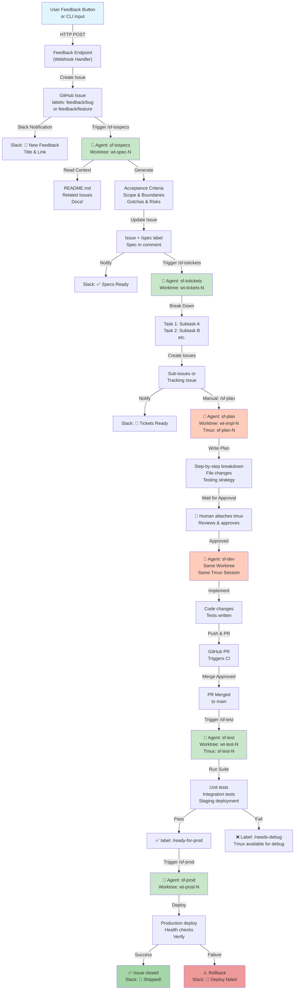
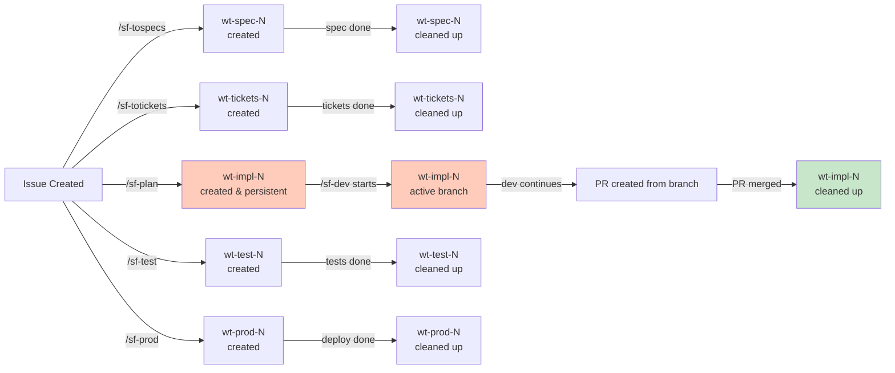

# Software Factory Architecture
## Feedback-Driven Autonomous Development Pipeline

**Date:** 2026.07.26  
**Author:** David  
**Status:** Concept & Design Phase  
**Repository:** github.com/kilo9alfa/softwarefactory

---

## Executive Summary

The **Software Factory** is an autonomous feedback-to-production pipeline that accelerates the journey from user feedback to deployed features. It combines GitHub as the source of truth, Slack for real-time communication, Claude Code agents for autonomous work, and tmux sessions for interactive oversight.

The factory operates in **6 stages**, with stages 1-2 and 4-5 running fully autonomously, and stage 3 (planning & development) requiring human judgment and approval.

---

## Vision & Goals

| Goal | Rationale | Success Metric |
|------|-----------|----------------|
| **Capture user signal at source** | User feedback is highest-fidelity input; must be actionable immediately | All feedback creates a GitHub issue within 5 minutes |
| **Minimize latency to specs** | Delay between feedback and specification increases ambiguity | Specs generated autonomously within 10 minutes |
| **Automate mechanical work** | Specs→tickets and test→prod are deterministic; don't require creativity | >95% of these stages complete without human intervention |
| **Preserve human judgment gates** | Planning and implementation benefit from design thinking and code review | Human explicitly approves design before code begins |
| **Enable opportunistic review** | Agents live in tmux; human can attach anytime to review, override, or debug | Human can observe any stage in real-time or post-mortem |
| **Single source of truth** | Reduce tool sprawl and keep state synchronized | GitHub issues are canonical; Slack is notifications only |

---

## Architecture Overview

### Stage Pipeline

```mermaid
graph LR
    A["👤 User Feedback"] --> B["📝 Classify & Create Issue"]
    B --> C["📋 1: Autonomous Specs<br/>/sf-tospecs"]
    C --> D["🎯 2: Autonomous Tickets<br/>/sf-totickets"]
    D --> E["🚪 3: MANUAL GATE<br/>Plan & Dev"]
    E --> F["✅ 4: Autonomous Test<br/>/sf-test"]
    F --> G["🚀 5: Autonomous Deploy<br/>/sf-prod"]
    
    style A fill:#e1f5ff
    style B fill:#fff9c4
    style C fill:#c8e6c9
    style D fill:#c8e6c9
    style E fill:#ffccbc
    style F fill:#c8e6c9
    style G fill:#c8e6c9
```

### Detailed Stage Flow with Worktrees

---

## Stage Details

### Stage 1: Autonomous Specs (`/sf-tospecs`)

| Aspect | Details |
|--------|---------|
| **Trigger** | Label: `feedback/*` on any GitHub issue |
| **Worktree** | `~/wt-spec-<issue-number>` |
| **Tmux Session** | `sf-spec-<issue-number>` (non-interactive, completes or fails) |
| **Agent Task** | Read issue + repository context → generate structured spec |
| **Inputs** | Issue title, description, linked context (README, docs, related issues) |
| **Outputs** | Structured spec comment on issue with: <ul><li>Acceptance criteria (bullet list)</li><li>Scope & boundaries</li><li>Known gotchas & risks</li><li>Estimated complexity</li></ul> |
| **Success Criteria** | Spec is complete, unambiguous, testable; human can implement from it |
| **Failure Mode** | Missing context → agent posts clarifying questions as comment, pauses |
| **Time Estimate** | 5–15 minutes (depends on codebase familiarity) |
| **Next Step** | Label issue `/spec`; notify Slack → stage 2 begins |

### Stage 2: Autonomous Tickets (`/sf-totickets`)

| Aspect | Details |
|--------|---------|
| **Trigger** | Label: `/spec` on issue |
| **Worktree** | `~/wt-tickets-<issue-number>` |
| **Tmux Session** | `sf-tickets-<issue-number>` (non-interactive) |
| **Agent Task** | Read spec → break into implementation tickets |
| **Inputs** | Spec comment, codebase structure (file tree, module boundaries) |
| **Outputs** | One or more child GitHub issues (sub-tasks), or add checklist to parent |
| **Checklist Example** | - [ ] Task 1: Create data model - [ ] Task 2: Implement API endpoint - [ ] Task 3: Write tests - [ ] Task 4: Update docs |
| **Success Criteria** | Each ticket is atomic, independently testable, sized for 2–4 hours |
| **Time Estimate** | 5–10 minutes |
| **Next Step** | Label issue `/tickets`; notify Slack → stage 3 awaits human |

### Stage 3a: Manual Planning (`/sf-plan`)

| Aspect | Details |
|--------|---------|
| **Trigger** | Human runs `/sf-plan <issue-number>` in Claude Code CLI |
| **Worktree** | `~/wt-impl-<issue-number>` (fresh, from main) |
| **Tmux Session** | `sf-plan-<issue-number>` (interactive, **waits for human approval**) |
| **Agent Task** | Read tickets → generate detailed implementation plan |
| **Inputs** | Issue, spec, tickets; codebase structure & patterns |
| **Outputs** | Plan document posted as issue comment with: <ul><li>Detailed step-by-step breakdown</li><li>Files to create/modify</li><li>Key decisions & rationale</li><li>Testing strategy</li><li>Rollback plan</li></ul> |
| **Human Input** | Attaches to tmux, reviews plan, approves or requests changes |
| **Approval Flow** | Agent waits via `SendMessage`; human responds → agent updates plan or proceeds to stage 3b |
| **Time Estimate** | 10–20 minutes (agent) + 5–15 minutes (human review) |
| **Next Step** | Approved → label `/planning-approved`; stage 3b begins in same worktree |

### Stage 3b: Manual Development (`/sf-dev`)

| Aspect | Details |
|--------|---------|
| **Trigger** | Automatic after `/sf-plan` approval (same tmux session) |
| **Worktree** | Same as `/sf-plan`: `~/wt-impl-<issue-number>` |
| **Tmux Session** | Same: `sf-plan-<issue-number>` (remains interactive for review cycles) |
| **Agent Task** | Implement the plan: write code, create tests, update docs |
| **Inputs** | Plan document, codebase context, test patterns |
| **Outputs** | Code changes, tests, documentation |
| **Iteration Loop** | <ul><li>Agent writes code</li><li>Pushes to branch</li><li>Creates draft PR or posts code for review</li><li>Human attaches to tmux, reviews, requests changes or approves</li><li>Agent iterates if needed</li></ul> |
| **Success Criteria** | PR is ready to merge: passes linting, has tests, no TODOs |
| **Time Estimate** | 30 minutes – 2 hours (highly variable) |
| **Next Step** | PR merged to main → label `/implemented`; stage 4 begins |

### Stage 4: Autonomous Testing (`/sf-test`)

| Aspect | Details |
|--------|---------|
| **Trigger** | PR merged to main (or label `/implemented` added) |
| **Worktree** | `~/wt-test-<issue-number>` |
| **Tmux Session** | `sf-test-<issue-number>` (non-interactive by default; available for debugging) |
| **Agent Task** | Checkout merged code → run full test suite → deploy to staging → smoke tests |
| **Inputs** | Merged branch, test suite, staging deployment credentials |
| **Outputs** | Test results, staging URL (if applicable), deployment logs |
| **Test Steps** | <ol><li>Run unit tests</li><li>Run integration tests</li><li>Run end-to-end tests</li><li>Deploy to staging environment</li><li>Run smoke tests on staging</li><li>Verify health checks pass</li></ol> |
| **On Pass** | Label `/ready-for-prod` → Slack: "✅ All tests pass" → stage 5 begins |
| **On Fail** | Label `/needs-debug`; post failure details as comment; leave tmux session alive for debugging |
| **Debug Mode** | Human attaches to tmux, investigates, fixes, re-runs tests |
| **Time Estimate** | 5–20 minutes (test suite dependent) |

### Stage 5: Autonomous Production Deploy (`/sf-prod`)

| Aspect | Details |
|--------|---------|
| **Trigger** | Label: `/ready-for-prod` on issue |
| **Worktree** | `~/wt-prod-<issue-number>` |
| **Tmux Session** | `sf-prod-<issue-number>` (non-interactive; observable) |
| **Agent Task** | Deploy from main to production; verify; close issue |
| **Deployment Steps** | <ol><li>Tag release (e.g., v1.2.3)</li><li>Run deployment script/CI</li><li>Monitor logs for errors</li><li>Run post-deploy smoke tests</li><li>Verify metrics/dashboards</li></ol> |
| **On Success** | <ul><li>Issue closed with comment: "Shipped in [version]"</li><li>Slack: "🚀 [feature name] deployed to production"</li><li>Optionally, worktree cleanup</li></ul> |
| **On Failure** | <ul><li>Initiate rollback</li><li>Label `/deploy-failed`</li><li>Slack: "🔴 Deploy failed; rollback initiated"</li><li>Leave tmux session available for post-mortem</li></ul> |
| **Time Estimate** | 5–15 minutes |

---

## Tool & Infrastructure Strategy

### Source of Truth: GitHub

| Artifact | Structure | Usage |
|----------|-----------|-------|
| **Issues** | feedback/* labels → /spec → /tickets → /implemented → /testing → /ready-for-prod → /deployed | Central work item; carries metadata (stage, complexity, owner) |
| **Labels** | feedback/bug, feedback/feature, /spec, /tickets, /planning-approved, /implemented, /testing, /ready-for-prod, /deployed, /needs-debug, /deploy-failed | Pipeline state machine; agents read/set labels to coordinate |
| **Projects** | Software Factory board (columns: Feedback → Spec → Tickets → Planning → Dev → Testing → Deploy → Done) | Visual dashboard; optional but useful for human oversight |
| **Branches** | issue-<number> or impl-<number> | Worktree-backed branches, one per implementation; deleted after merge |

### Communication: Slack

| Event | Slack Notification | Channel | Action |
|-------|-------------------|---------|--------|
| Feedback received | "📝 New feedback: [title]" | #software-factory | User aware; issue created |
| Specs generated | "✅ Specs ready for review" | #software-factory | Human can review if desired |
| Tickets broken down | "🎯 Breakdown ready; awaiting plan" | #software-factory | Signals next stage |
| Plan generated | "📋 Plan ready for approval (@david)" | #software-factory | Human action required; link to tmux attach command |
| Dev in progress | "🔨 [name] in development" | #software-factory | Informational |
| PR created | "🔀 PR #123 ready for review" | #software-factory | Link to PR |
| Tests pass | "✅ All tests pass; ready for production" | #software-factory | Informational |
| Deploy initiated | "🚀 Deploying [version] to production..." | #software-factory | Real-time monitoring |
| Deploy success | "✅ [feature] shipped to production" | #software-factory | Celebration 🎉 |
| Deploy failed | "🔴 Deploy failed; rollback initiated. Investigate: tmux attach -t sf-prod-N" | #software-factory | Urgent; human action |

### Agent Execution: tmux Sessions

| Session Name | Purpose | Lifetime | Interactive? |
|--------------|---------|----------|--------------|
| `sf-spec-N` | Stage 1 agent | Until spec is generated or error | No (fire-and-forget) |
| `sf-tickets-N` | Stage 2 agent | Until tickets are created or error | No (fire-and-forget) |
| `sf-plan-N` | Stage 3a agent | Persists until plan approved & dev complete | **Yes** (human attaches for review) |
| `sf-test-N` | Stage 4 agent | Until tests complete or error | Mostly no, but human can debug |
| `sf-prod-N` | Stage 5 agent | Until deploy succeeds or fails | Observable, human intervenes on fail |

### Worktree Lifecycle

---

## Advantages

| Advantage | Impact | Why It Matters |
|-----------|--------|----------------|
| **Rapid feedback loop** | User → spec → code → production in **hours** (vs. days/weeks in traditional workflows) | Faster user validation; faster feedback cycles for iteration |
| **Capture signal at source** | Feedback button captures context (URL, screenshot, metadata) | High-fidelity input; no telephone game; reduces ambiguity |
| **Autonomous boring work** | Agents handle specs, tickets, test, deploy without human CPU | Engineers focus on creative design & code review (highest-value work) |
| **Human judgment preserved** | Manual gate at planning & development; human designs before coding | Prevents "garbage in, garbage out"; design quality remains high |
| **Debuggable pipeline** | All work happens in persistent tmux sessions; human can attach anytime | Easy diagnosis when things go wrong; no "black box" agent failures |
| **GitHub as source of truth** | Single, version-controlled repository for all metadata | No state sprawl; git history = audit trail; integrates with existing workflows |
| **Slack awareness** | Real-time notifications at every stage | Team stays informed; easy to spot delays or failures |
| **Worktree isolation** | Each stage gets a fresh checkout; no cross-contamination | Easy rollback; safe parallelization; reproducible builds |
| **Incremental adoption** | Can start with stages 1-2 (specs & tickets), add stages 3-5 later | Lower risk; validate early; iterate on architecture |
| **Scaling agents** | Each stage is independent; can spawn multiple agents in parallel | Handle bursts of feedback without bottlenecks |

---

## Disadvantages & Risks

| Risk | Severity | Mitigation |
|------|----------|-----------|
| **Spec quality** | Medium | Agent may miss nuance or generate overly broad specs. Mitigation: feedback loop to clarify; human review at /sf-plan stage catches issues before coding starts |
| **Ticket breakdown** | Medium | Agent may over/under-decompose. Mitigation: if tickets are too coarse/fine, human adjusts during /sf-plan; agent re-runs if needed |
| **Over-automation** | Medium | Temptation to automate stages 3a-3b (planning/dev) without human judgment. Mitigation: **resist** this; human must approve plan before code begins. A poorly designed feature shipped fast is worse than a well-designed feature shipped slightly slower |
| **Test coverage** | Medium | Agent may miss edge cases; tests may not catch latent bugs. Mitigation: /sf-test stage includes staging deployment + smoke tests; humans monitor prod metrics post-launch |
| **Deployment risk** | Medium-High | Autonomous deploy to production without human explicit approval is risky. Mitigation: require explicit approval (e.g., human runs `/sf-prod` or approves via Slack) before production deploy begins |
| **Tmux session bloat** | Low | If agents crash or hang, tmux sessions accumulate. Mitigation: cron job to clean up stale sessions; naming convention makes cleanup easy |
| **Worktree cleanup** | Low | If worktrees aren't cleaned up properly, disk fills. Mitigation: explicit cleanup after each stage; cron job to prune stale worktrees |
| **Agent hallucinations** | Medium | Agent may generate plausible but incorrect specs, code, or plans. Mitigation: human review at manual gates; test suite catches code bugs; spec review catches design errors |
| **Feedback quality** | Low-Medium | Users may provide vague or contradictory feedback. Mitigation: agent asks clarifying questions if spec is ambiguous; human can always override via manual /sf-plan |
| **Context explosion** | Medium | Large codebases may result in agents missing relevant context. Mitigation: codebase indexing (e.g., vector DB of docs/modules); agent can search for relevant files |
| **Cost** | Low-Medium | Each agent invocation is a Claude API call. Mitigation: reuse context across stages; batch related feedback; consider model choice (Haiku for routing, Opus for complex work) |
| **Learning curve** | Low | Team must learn new commands, tmux attach patterns, label schema. Mitigation: documentation, examples, runbooks; start with single human driving it |

---

## Implementation Roadmap

### Phase 1: Foundation (Weeks 1–2)
- [ ] Create GitHub repo (kilo9alfa/softwarefactory)
- [ ] Design GitHub issue schema & labels
- [ ] Build feedback endpoint (HTTP or CLI)
- [ ] Implement `/sf-tospecs` skill
- [ ] Test end-to-end: feedback → issue → spec

### Phase 2: Autonomous Pipeline (Weeks 3–4)
- [ ] Implement `/sf-totickets` skill
- [ ] Implement `/sf-test` skill (basic test runner)
- [ ] Implement `/sf-prod` skill (basic deploy)
- [ ] Set up Slack integration
- [ ] Test stages 1, 2, 4, 5 end-to-end

### Phase 3: Manual Gates (Weeks 5–6)
- [ ] Implement `/sf-plan` skill (tmux + approval loop)
- [ ] Implement `/sf-dev` skill (code generation + iteration)
- [ ] Integrate plan/dev with tmux session management
- [ ] Test full pipeline: feedback → design → code → test → deploy

### Phase 4: Hardening & Ops (Weeks 7–8)
- [ ] Error handling, retry logic, rollback procedures
- [ ] Monitoring & observability (logging, metrics)
- [ ] Cleanup automation (worktree, tmux, old branches)
- [ ] Documentation & runbooks
- [ ] Load testing (concurrent feedback, parallel agents)

### Phase 5: Enhancement & Learning (Ongoing)
- [ ] Improve agent prompts based on failure analysis
- [ ] Add context indexing (vector DB for codebase search)
- [ ] Experiment with multi-agent workflows (e.g., spec review by independent agent)
- [ ] Cost optimization (model selection, batching)
- [ ] Feedback loop: analyze which issues → specs → actual deployments, iterate

---

## Success Metrics

| Metric | Target | Measurement |
|--------|--------|-------------|
| **Feedback → Spec latency** | < 15 min | Timestamp from issue creation to /spec label |
| **Spec → Tickets latency** | < 15 min | Timestamp from /spec to /tickets label |
| **Tickets → Deploy latency** | < 4 hours | Timestamp from /tickets to /deployed label |
| **End-to-end latency** | < 5 hours | From feedback to production |
| **Autonomous stage success rate** | > 90% | % of stages 1, 2, 4, 5 that complete without error |
| **Human review cycle time** | < 30 min | Avg time from plan posted to human approval |
| **Deployment success rate** | > 99% | % of prod deployments that don't trigger rollback |
| **Issue resolution time** | < 1 day | From feedback to issue closed (deployed) |

---

## Architecture Decisions

| Decision | Rationale | Alternative Considered |
|----------|-----------|------------------------|
| **GitHub as source of truth** | Native integrations, audit trail via git, familiar to engineers | Jira, Linear — more feature-rich but adds tool sprawl |
| **Slack for notifications only** | Reduces context switching; doesn't store state | Slack as coordination layer — risk of divergent state |
| **tmux for agent persistence** | Agents stay live for debugging/override; visible to human | Fire-and-forget agents — harder to debug, no override path |
| **Worktree isolation per stage** | Clean checkouts prevent cross-contamination | Single branch per issue — risky if multiple agents write simultaneously |
| **Manual gate at planning** | Design thinking requires human judgment; prevents "garbage code" shipped fast | Full automation — faster but risky; cultural misalignment with quality-first philosophy |
| **Agent workflow (not pure CLI)** | Supports long-running tasks, approval loops, state management | Pure skill commands — can't easily pause/wait for approval |
| **Pervasive use of labels** | Lightweight state machine; easy for agents to read/set; humans can query | Worktree naming only — harder to track state; label queries are powerful |

---

## Open Questions & Future Exploration

1. **Feedback ingestion:** Should we build a custom browser extension, or start with a simple CLI/HTTP endpoint?
2. **Approval flow:** After `/sf-plan` generates a plan, should approval be manual (human attaches tmux) or via Slack reaction?
3. **Multi-agent specs:** Should we have a "spec review" agent that independently validates the initial spec before proceeding to tickets? (Adds cost but improves quality.)
4. **Prioritization:** When multiple issues are in flight, should agents work sequentially or spawn parallel agents per issue?
5. **Cost optimization:** Should we use cheaper models (Haiku) for routing/classification, and reserve Opus for complex reasoning?
6. **Integration with existing CI/CD:** How does this integrate with existing GitHub Actions workflows? Should agents invoke existing scripts, or replace them?
7. **Codebase context:** For large codebases, should we index code (vector DB) to help agents find relevant files faster?
8. **Human override:** If a human thinks an agent decision is wrong, can they override and re-run the stage? (Yes, but need UI for this.)
9. **Observability:** What metrics/logs should we collect to measure effectiveness and identify bottlenecks?
10. **Team collaboration:** How do multiple humans coordinate if both want to review/approve the same stage?

---

## Glossary

| Term | Definition |
|------|-----------|
| **Feedback** | User input (bug report, feature request, complaint) captured via button, CLI, or API |
| **Spec** | Structured requirements document: what to build, acceptance criteria, scope, gotchas |
| **Ticket** | Atomic, implementable task broken down from spec; unit of work for a developer |
| **Plan** | Detailed implementation roadmap: files to change, testing strategy, rollback plan |
| **Worktree** | Git worktree; isolated checkout of repo; allows parallel work on multiple branches |
| **Tmux session** | Terminal multiplexer session; persistent, human can attach/detach; useful for long-running agents |
| **Stage** | One phase of the pipeline (e.g., specs, tickets, test, deploy) |
| **Label** | GitHub issue label; used as state machine for pipeline coordination |
| **Autonomous** | Agent completes without human intervention (stages 1, 2, 4, 5) |
| **Manual** | Human actively involved (stage 3: planning & development) |

---

## References & Related Work

- **GitHub Projects:** Visual task management (optional layer)
- **Claude Code Agents:** Multi-step reasoning, tool use, long-context understanding
- **MCP Servers:** GitHub, Slack integration
- **Workflow Tool:** Orchestrate multi-phase pipelines with human checkpoints
- **tmux:** Terminal multiplexer; enables session persistence & human oversight
- **Git Worktrees:** Lightweight, isolated checkouts; support parallel work

---

## Next Steps

1. **Validate with stakeholders:** Review this design; confirm alignment with goals & risk tolerance.
2. **Spike Phase 1:** Build feedback endpoint + `/sf-tospecs` skill; run 3-5 real examples end-to-end.
3. **Iterate architecture:** Based on spike learnings, refine worktree lifecycle, approval flow, error handling.
4. **Build Phase 2:** Autonomous pipeline (tickets, test, deploy).
5. **Build Phase 3:** Manual gates (plan, dev).
6. **Harden & operate:** Monitoring, cleanup, documentation.

