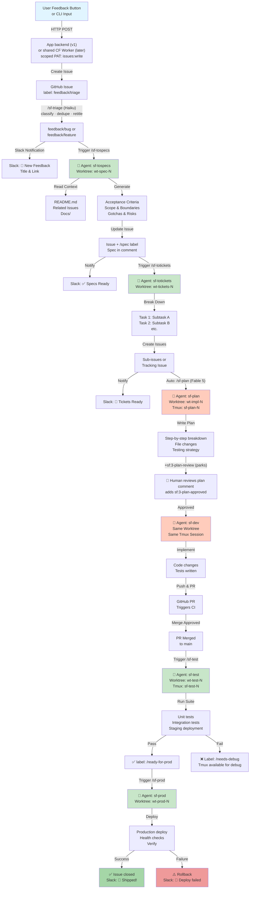
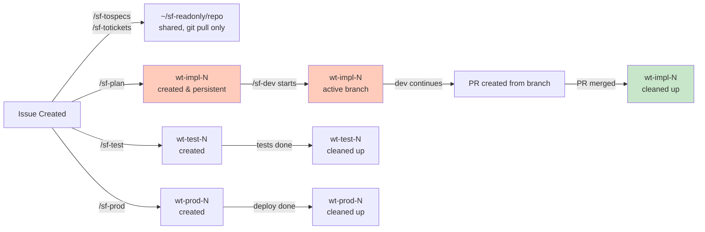

# Software Factory Architecture
## Feedback-Driven Autonomous Development Pipeline

**Date:** 2026.07.26  
**Author:** David  
**Status:** Concept & Design Phase  
**Repository:** github.com/kilo9alfa/softwarefactory

---
## Executive Summary

The **Software Factory** is an autonomous feedback-to-production pipeline that accelerates the journey from user feedback to deployed features. It combines GitHub as the source of truth, Slack for real-time communication, Claude Code agents for autonomous work, and tmux sessions for interactive oversight. All agents run on **Nuclaw** (the always-on home server), reachable from anywhere via Tailscale.

The factory operates in **stage 0 (feedback capture) plus 5 numbered stages**: stages 1–2 (specs, tickets) and 4 (test) run fully autonomously, and **stage 3a (planning) now generates autonomously too** — but it pauses at a **human approval gate** before stage 3b (development), and stage 5 (production deploy) is human-triggered. The human judgment gates are the *plan approval* and the *deploy trigger*, not the mechanical launching of each stage.

Two deliberate platform constraints:

1. **Runs entirely on Claude Code** — every agent is a `claude` CLI invocation (interactive or `claude -p`) under the existing Claude subscription. No direct Claude API calls, no API keys to manage, no per-token billing surprises.
2. **Distributed as a Claude Code plugin** — the skills, agents, hooks, and dispatcher scripts are packaged in this repo as an installable plugin (`/plugin install`), so any machine with Claude Code + `gh` + tmux can become a factory node.


## Vision & Goals

| Goal | Rationale | Success Metric |
|------|-----------|----------------|
| **Capture user signal at source** | User feedback is highest-fidelity input; must be actionable immediately | All feedback creates a GitHub issue within 5 minutes |
| **Minimize latency to specs** | Delay between feedback and specification increases ambiguity | Specs generated autonomously within 10 minutes |
| **Automate mechanical work** | Specs→tickets and test→prod are deterministic; don't require creativity | >95% of these stages complete without human intervention |
| **Preserve human judgment gates** | Planning and implementation benefit from design thinking and code review | Human explicitly approves design before code begins |
| **Enable opportunistic review** | Agents live in tmux; human can attach anytime to review, override, or debug | Human can observe any stage in real-time or post-mortem |
| **Single source of truth** | Reduce tool sprawl and keep state synchronized | GitHub issues are canonical; Slack is notifications only |

---

## Architecture Overview

### Detailed Stage Pipeline Flow with Worktrees

Each box below is executed either by a **shell script** (`.sh`, deterministic, no LLM) or a **Claude Code session** (`claude -p`, headless, or interactive). The trusted/untrusted split matters: the LLM stages only *advise* (emit JSON / write comments); the shell scripts do the privileged state transitions (swapping labels, creating issues, deploying). The executor for every box is tabulated immediately after the diagram.



**What runs in each box:**

| Box | Executor | What it is | Model |
|-----|----------|-----------|-------|
| `EP` (feedback endpoint) | **script** | App backend / CF Worker: `POST /issues` with scoped PAT | — |
| `GH` → `GHC` (triage) | **script + `claude -p`** | Dispatcher launches `/sf-triage` (advisory JSON); trusted `sf-apply-label.sh` validates the JSON and swaps the label | Haiku |
| `SPEC` (`/sf-tospecs`) | **`claude -p`** | Headless session, reads code, posts spec comment | Sonnet |
| `TICK` (`/sf-totickets`) | **`claude -p`** | Headless session, breaks spec into tickets | Opus |
| `PLAN` (`/sf-plan`) | **`claude -p`** | Headless session generates plan; parks at `sf:3-plan-review` (approval is **label-driven**, no live session) | Fable 5 |
| `DEV` (`/sf-dev`) | **`claude -p` + scripts** | Headless in an isolated worktree (`sf-prep-worktree.sh`); commits locally; `sf-apply-dev.sh` pushes + opens a **draft PR** (human reviews the PR) | Opus |
| `TEST` (`sf-test.sh`) | **script-only** | Runs the repo's `.sf.yml` `test:` command; label = exit code (no LLM) | none |
| `PROD` (`sf-prod.sh`) | **script (human-run) + summary** | Runs `.sf.yml` `deploy:` (label = exit code); `/sf-prod` skill writes the deploy report | Sonnet (summary) |
| Dispatcher (not shown) | **script** | systemd-timer poller: `gh issue list` → `tmux new -d … claude -p` | — |

### The Dispatcher (the glue between labels and agents)

Labels are the pipeline's state machine, but something must **watch for label changes and launch the agents**. This component is deliberately simple:

| Aspect                        | Design                                                                                                                                                                                                                          |
| ----------------------------- | ------------------------------------------------------------------------------------------------------------------------------------------------------------------------------------------------------------------------------- |
| **What it is**                | A small poller script running on Nuclaw (systemd timer or cron, every 1–2 min)                                                                                                                                                  |
| **What it does**              | `gh issue list --label <trigger-label>` per stage → for each match, spawn `tmux new -d -s sf-<stage>-<N> 'claude --dangerously-skip-permissions -p "/sf-<stage> <N>"'`                                                          |
| **Idempotency**               | Before spawning, check `tmux has-session -t sf-<stage>-<N>` AND that the stage's *output* label isn't already set — prevents duplicate agents if the poller fires twice                                                         |
| **State transitions**         | The dispatcher only *launches*; agents themselves swap labels on completion (remove trigger label, add output label). One writer per transition                                                                                 |
| **Why polling, not webhooks** | No inbound port exposure on Nuclaw; `gh` polling is trivial to debug and rate limits are generous. A GitHub Actions → Tailscale webhook can replace it later if 1–2 min latency ever matters                                    |
| **Failure handling**          | If an agent's tmux session dies without setting an output label, the issue stays on its trigger label — the dispatcher notices the missing session and can relaunch (with a retry-count label like `sf:retries-2` to cap loops) |

---

## Stage Details

Every stage table below carries an **Executor** row (`script` vs `claude` session) and, for Claude sessions, a **Model** row. Model choice is the primary cost/quality lever (see [Runtime](#runtime-claude-code-only-no-direct-api)).

### Stage 0: Feedback Capture (the button) + Triage (`/sf-triage`)

> **Status:** Triage ✅ **built & verified**. Capture (the button / HTTP endpoint) ⬜ **NOT built** — today issues enter via manual/CLI `gh issue create --label feedback/triage`. Wiring the user-facing feedback endpoint is the main pending gap for real-world use (see Status snapshot).

This stage has two halves. **Capture** is a *script* (the app backend / CF Worker) that turns a button press into a `feedback/triage` issue. **Triage** is the `/sf-triage` Claude session — the classification step referenced throughout is exactly `/sf-triage`. Following the [triage-skill pattern](https://github.com/mattpocock/skills/blob/main/skills/engineering/triage/SKILL.md), triage assigns exactly one *category* role (`bug`/`feature`) and prepends an AI-disclaimer to any comment it posts. Crucially, `/sf-triage` only emits advisory JSON; a trusted script (`sf-apply-label.sh`) validates that classification is exactly `bug|feature|spam` before swapping the label — so a disobedient or prompt-injected model can never move the issue on its own.

| Aspect               | Details                                                                                                                                                                                                                                                                                                                                                                                                |
| -------------------- | ------------------------------------------------------------------------------------------------------------------------------------------------------------------------------------------------------------------------------------------------------------------------------------------------------------------------------------------------------------------------------------------------------ |
| **Executor**         | *Capture:* script (app backend / CF Worker). *Triage:* `claude -p /sf-triage` (advisory) + `sf-apply-label.sh` (trusted state transition)                                                                                                                                                                                                                                                             |
| **Model**            | Haiku (triage) — classification is a fast, bounded task                                                                                                                                                                                                                                                                                                                                               |
| **Source**           | In-app feedback button (localr5-style apps); <br>CLI/manual issue creation also works — anything that produces a `feedback/*` issue enters the pipeline<br>                                                                                                                                                                                                                                            |
| **Path (v1)**        | Button → app's own backend → GitHub REST (`POST /repos/kilo9alfa/<repo>/issues`) with a fine-grained PAT scoped to issues:write on that repo only. No new infrastructure                                                                                                                                                                                                                               |
| **Path (later)**     | When multiple apps feed the factory: one shared Cloudflare Worker endpoint holds the token; apps POST feedback to it. Adds rate-limiting, dedup, screenshot upload in one place                                                                                                                                                                                                                        |
| **Classification**   | LLM triage: a single generic "Feedback" button — every issue lands with `feedback/triage`. <br>The dispatcher launches `/sf-triage` (Haiku, seconds of runtime): it re-classifies to `feedback/bug` or `feedback/feature`, rewrites a clean title, flags duplicates (links the existing issue, closes the new one), and discards spam/noise. <br><br>Users never have to categorize their own feedback |
| **Context captured** | Issue body auto-includes: page URL, app version, user agent, timestamp, optional screenshot, optional user comment. <br>The button is the only component that has this context — capture it here or lose it                                                                                                                                                                                            |
| **Security**         | The PAT can *only* create issues on one repo — worst case for a leaked token is issue spam. <br>Feedback text is untrusted user input: agents downstream treat it as data, never as instructions                                                                                                                                                                                                       |
| **Next Step**        | Issue created as `feedback/triage` → `/sf-triage` classifies → `feedback/bug` or `feedback/feature` → Slack notification → dispatcher picks it up for stage 1                                                                                                                                                                                                                                          |

### Stage 1: Autonomous Specs (`/sf-tospecs`)

Drawing on the [to-spec skill](https://github.com/mattpocock/skills/blob/main/skills/engineering/to-spec/SKILL.md): the spec is synthesized from *existing* context only — the agent does **not** interview the user (there's no human in the loop at this stage). It explores the codebase first to adopt the project's domain vocabulary and respect existing architectural decisions (ADRs), and it **maps the testing seams** — identifying where the feature would be validated, preferring the highest existing integration seam and minimizing new ones.

| Aspect               | Details                                                                                                                                                                                                                            |
| -------------------- | ---------------------------------------------------------------------------------------------------------------------------------------------------------------------------------------------------------------------------------- |
| **Executor**         | `claude -p /sf-tospecs <N>` (headless, non-interactive)                                                                                                                                                                           |
| **Model**            | Sonnet — needs codebase comprehension and judgment, but not top-tier reasoning                                                                                                                                                    |
| **Trigger**          | Label: `feedback/*` on any GitHub issue (picked up by the dispatcher)                                                                                                                                                              |
| **Worktree**         | None — this stage only *reads* code. <br><br>Runs against a shared, read-only checkout of `main` (`~/sf-readonly/<repo>`, refreshed by the dispatcher with `git pull` before launch). Worktrees are reserved for stages that write |
| **Tmux Session**     | `sf-spec-<issue-number>` (non-interactive, completes or fails)                                                                                                                                                                     |
| **Agent Task**       | Explore codebase → adopt domain vocabulary → map testing seams → generate structured spec                                                                                                                                          |
| **Inputs**           | Issue title, description, linked context (README, docs, related issues)                                                                                                                                                            |
| **Outputs**          | Structured spec comment on issue with: <ul><li>Problem statement & solution (user's perspective)</li><li>User stories / acceptance criteria</li><li>Scope & boundaries + explicit **Out of Scope**</li><li>Implementation decisions (modules, interfaces, contracts — no file paths)</li><li>Testing decisions (which seams, what a good test looks like)</li><li>Known gotchas & risks; estimated complexity</li></ul> |
| **Success Criteria** | Spec is complete, unambiguous, testable; human can implement from it                                                                                                                                                               |
| **Failure Mode**     | Missing context → agent posts clarifying questions as comment, pauses                                                                                                                                                              |
| **Time Estimate**    | 5–15 minutes (depends on codebase familiarity)                                                                                                                                                                                     |
| **Next Step**        | Label issue `sf:1-spec`; notify Slack → stage 2 begins                                                                                                                                                                               |

### Stage 2: Autonomous Tickets (`/sf-totickets`)

Drawing on the [to-tickets skill](https://github.com/mattpocock/skills/blob/main/skills/engineering/to-tickets/SKILL.md): tickets are **vertical slices** (tracer bullets), not horizontal layers. Each slice is a narrow but complete path through all layers (schema → API → UI → tests) that is independently demoable/verifiable and sized to fit a single agent context window. Blocking edges between tickets must reflect *genuine* dependencies. Wide refactors use expand–contract sequencing (add new form alongside old → migrate in green-CI batches → remove old), each batch its own ticket.

| Aspect | Details |
|--------|---------|
| **Executor** | `claude -p /sf-totickets <N>` (headless, non-interactive) |
| **Model** | Opus — decomposition quality compounds downstream; worth the strongest reasoning |
| **Trigger** | Label: `sf:1-spec` on issue |
| **Worktree** | None — read-only stage, same shared checkout as stage 1 |
| **Tmux Session** | `sf-tickets-<issue-number>` (non-interactive) |
| **Agent Task** | Read spec → explore codebase for vocabulary → draft vertical slices with blocking edges |
| **Inputs** | Spec comment, codebase structure (file tree, module boundaries) |
| **Outputs** | One or more child GitHub issues (vertical-slice sub-tasks) with native blocking relationships, or a dependency-ordered checklist on parent |
| **Checklist Example** | - [ ] Slice 1: minimal end-to-end path (schema + API + UI + test)<br>- [ ] Slice 2: second capability, blocked-by Slice 1<br>- [ ] Slice 3: edge cases & hardening |
| **Success Criteria** | Each ticket is a complete vertical slice, independently verifiable, sized for one context window |
| **Time Estimate** | 5–10 minutes |
| **Next Step** | Label issue `sf:2-tickets`; notify Slack → stage 3 awaits human |

### Stage 3a: Autonomous Planning + Human Approval Gate (`/sf-plan`)

**Plan *generation* is autonomous** — the dispatcher launches `/sf-plan` automatically once `sf:2-tickets` is set, exactly like stages 1–2. What stays human is the **approval gate**, which is **label-driven** (not an interactive tmux block — a headless `claude -p` run cannot block for input): the agent generates the plan headlessly, `sf-apply-plan.sh` posts it and adds `sf:3-plan-review`, and the issue **parks** there. A human reviews the plan comment and approves by adding `sf:3-plan-approved` (via `sf-approve-plan.sh <N>` or the GitHub UI) — that label is what unblocks stage 3b. This preserves the "design before code" judgment gate while removing the manual step of kicking off planning. A good plan gates everything downstream, so this stage uses **Fable 5**.

| Aspect | Details |
|--------|---------|
| **Executor** | *Generation:* `claude -p /sf-plan <N>` (headless, dispatcher-launched) + `sf-apply-plan.sh` (trusted, → `sf:3-plan-review`). *Approval:* `sf-approve-plan.sh <N>` (human-only, → `sf:3-plan-approved`) |
| **Model** | Fable 5 — plan quality gates everything downstream; use the best reasoning available |
| **Trigger** | **Automatic:** label `sf:2-tickets` on issue (dispatcher-launched, like stages 1–2) — no longer a manual command |
| **Worktree** | None — generation only *reads* code (like stages 1–2, shared read-only checkout). The `~/wt-impl-<issue-number>` worktree is created at stage 3b (dev), not here |
| **Tmux Session** | `sf-plan-<issue-number>` (non-interactive; generates the plan, then completes) |
| **Agent Task** | Read spec + tickets → explore codebase → generate detailed implementation plan mapped to the ticket slices |
| **Inputs** | Issue, spec, tickets; codebase structure & patterns |
| **Outputs** | Plan document posted as issue comment with: <ul><li>Approach + step-by-step breakdown (mapped to slices)</li><li>Files to create/modify</li><li>Key decisions & rationale</li><li>Testing strategy</li><li>Rollback plan + open risks</li></ul> |
| **Human Input** | (Later: notified via Slack.) Reviews the plan comment, then adds `sf:3-plan-approved` to approve — or edits tickets/re-runs if the plan is wrong |
| **Approval Flow** | Issue parks at `sf:3-plan-review`; the dispatcher never advances past it. Human adds `sf:3-plan-approved` → stage 3b becomes eligible. One human decision, label-driven — no live session to attach to |
| **Time Estimate** | ~1 minute (agent, autonomous) + human review time |
| **Next Step** | Approved → label `sf:3-plan-approved`; stage 3b creates `wt-impl-<N>` and begins |

### Stage 3b: Autonomous Development (`/sf-dev`)

**Dev is autonomous**, not an interactive tmux session (same headless constraint as 3a). Because the plan was already human-approved at 3a, dev runs headless in an isolated worktree and produces a **draft PR** — and the **PR is the code-review gate**: a human reviews the diff on GitHub before merge. Two gates bracket the autonomous work: plan-approval (3a) + PR review (3b). The **advisory/trusted split holds**: the `/sf-dev` skill writes code + tests and commits **locally only** (no `gh` writes); trusted scripts do the outward mutations (worktree prep, push, PR, label).

| Aspect | Details |
|--------|---------|
| **Executor** | *Prep:* `sf-prep-worktree.sh <N>` (isolated `wt-impl-N`, branch `sf/impl-N`). *Code:* `claude -p /sf-dev <N>` headless, cwd = worktree (commits locally). *Publish:* `sf-apply-dev.sh` (trusted: push + draft PR + `sf:4-implemented`) |
| **Model** | Opus — code generation quality |
| **Trigger** | **Automatic:** label `sf:3-plan-approved` (dispatcher-launched) |
| **Worktree** | `~/sf-worktrees/<owner-repo>/impl-<N>` (namespaced per repo; branch `sf/impl-<N>` from the default branch). Created by `sf-prep-worktree.sh`; cleaned up after merge |
| **Tmux Session** | `sf-dev-<issue-number>` (non-interactive; implements, commits, then completes) |
| **Agent Task** | Read spec+tickets+approved plan → implement in the worktree → write/run tests → commit locally → emit `<!--DEV-->` summary |
| **Inputs** | Approved plan, spec, tickets; codebase context, test patterns |
| **Outputs** | Local commits on `sf/impl-N` → pushed → **draft PR** referencing the issue, with the DEV summary as the PR body |
| **Review gate** | Human reviews the **draft PR** on GitHub (not a tmux attach); marks ready / requests changes / merges |
| **Success Criteria** | Draft PR opened with the plan implemented + tests; ready for human review and stage 4 |
| **Time Estimate** | Minutes (agent) + human PR-review time |
| **Next Step** | Label `sf:4-implemented` (set at PR open); PR merge → stage 4 (test) begins |

### Stage 4: Autonomous Testing (`sf-test.sh`)

**Test gating is deterministic — a script, not an LLM.** `sf-test.sh` checks out the issue's branch, runs the repo's real test command (from `.sf.yml`), and sets the label **purely from the command's exit code**. No model gets to "decide" pass/fail — that would be unsafe. (A future `/sf-test` *skill* can layer on to *summarize* failures, but the gate stays the exit code.)

| Aspect | Details |
|--------|---------|
| **Executor** | `sf-test.sh <N>` — **script-only, no LLM**. Runs in a tmux session for observability |
| **Model** | none — deterministic; pass/fail = the test command's exit code |
| **Trigger** | Label `sf:4-implemented` (dispatcher-launched) |
| **Config** | `.sf.yml` `test:` — the shell command to run (e.g. `bash tests/smoke.sh`, or `cd sub && pytest -q` for a monorepo). No command → **`sf:5-test-skipped`** (terminal). ⚠️ This used to leave the issue at `sf:4-implemented`, which made it a candidate again every cycle until the 3-attempt cap fired a 🛑 "needs a human" alert — for a config gap retrying cannot fix. It jammed `databeacon/localr5` #102/#103/#104 on 2026.07.29. **Rule: every stage's exit paths must be terminal for that stage.** |
| **Worktree** | Reuses/creates `~/sf-worktrees/<repo>/impl-<N>` on branch `sf/impl-<N>` |
| **Steps** | <ol><li>Guard: require `sf:4-implemented`, skip if already tested</li><li>Check out `sf/impl-N`</li><li>Read `.sf.yml` `test:`</li><li>Run it, capture exit code + output</li></ol> |
| **On Pass** (exit 0) | Label `sf:5-ready-for-prod`; comment "✅ tests pass" with output (collapsed) → stage 5 awaits explicit human go |
| **On Fail** (exit ≠0) | Label `sf:5-needs-debug`; comment the failing output tail |
| **Log** | `~/.local/share/softwarefactory/logs/test-<N>.log` — tee'd from the tmux session, same as every other stage. (Until 2026.07.29 this stage wrote no log at all, so the gave-up alert's "see test-N.log" pointed at a file that never existed.) |
| **Staging** | Staging deploy + smoke tests (`.sf.yml` `staging_url`) are a later addition; MVP gates on the test command only |
| **Time Estimate** | Test-suite dependent |

### Stage 5: Production Deploy (`sf-prod.sh` + `/sf-prod` summary)

**Human-triggered only — never dispatcher-launched** (highest blast radius). A person runs `bash scripts/sf-prod.sh <N>` on an issue at `sf:5-ready-for-prod`. Like stage 4 it's **script + deterministic gate**: `sf-prod.sh` runs the `.sf.yml` `deploy:` command and sets the label from its **exit code**. It then invokes the `/sf-prod` **skill (Sonnet) to write a human-readable deploy report** — advisory only; the skill never decides success/failure.

| Aspect | Details |
|--------|---------|
| **Executor** | `sf-prod.sh <N>` (trusted, human-run) runs `.sf.yml` `deploy:` and gates on exit code, then calls `claude -p /sf-prod <N>` for the summary |
| **Model** | Sonnet — **summary only** (the deploy log → readable report); pass/fail = the deploy command's exit code, not the model |
| **Trigger** | **Human** runs `sf-prod.sh <N>` on `sf:5-ready-for-prod`. Never dispatcher-triggered (see Risks) |
| **Config** | `.sf.yml` `deploy:` — the shell command to deploy (run in the issue's worktree) |
| **Worktree** | Reuses/creates `sf/impl-<N>` worktree |
| **On Success** (exit 0) | Label `sf:6-deployed`; post 🚀 "Shipped" + the LLM deploy report; **close the issue** |
| **On Failure** (exit ≠0) | Label `sf:6-deploy-failed`; post the report + deploy-log tail; issue stays open for post-mortem |
| **Rollback** | Encoded in the repo's own `deploy:` command / runbook (repo-specific); a future `.sf.yml` `rollback:` can formalize it |
| **Time Estimate** | Deploy-command dependent |

---

## Tool & Infrastructure Strategy

### Runtime: Claude Code only (no direct API)

| Aspect | Design |
|--------|--------|
| **Agent runtime** | The LLM stages (triage, spec, tickets, plan, dev) all run **headless** (`claude --dangerously-skip-permissions -p "/sf-<stage> <N>"` inside tmux) — including stage 3b dev (writes in an isolated worktree, opens a draft PR). **No stage is interactive.** Stage 4 (test) is **script-only** (no LLM — gates on the test command's exit code). The human gates are label-driven, not tmux attaches: *plan approval* (`sf:3-plan-approved`) and the *stage-5 trigger* |
| **Permissions** | `--dangerously-skip-permissions` everywhere — autonomy is the point; permission prompts would deadlock headless sessions. The safety model shifts from per-tool prompts to: scoped credentials (stages 1–3 have no deploy creds), worktree isolation, human plan approval, and the human-only trigger on stage 5 |
| **Billing** | Claude subscription usage limits — no API key, no per-token invoicing. Cost control = model choice per skill + usage caps, not budget alarms |
| **Model selection** | Per-skill/per-agent `model` frontmatter, tiered by stage: `haiku` (triage), `sonnet` (specs, test, prod), `opus` (tickets, dev), `fable 5` (planning) — same lever as API model choice, without the API. Cheap-and-fast for bounded tasks; strongest reasoning where quality compounds downstream (tickets, plan) |
| **Auth** | Standard `claude` login on the factory host (Nuclaw); `gh` CLI already authenticated. Nothing new to secure beyond what the machine already has |
| **What we give up** | Fine-grained programmatic control (streaming callbacks, token accounting per call). Acceptable: the pipeline's control flow lives in labels + the dispatcher, not in API orchestration code |

### Distribution: Claude Code plugin

The factory installs as a plugin from this repo — no copy-pasting skills between machines:

```
softwarefactory/
├── .claude-plugin/
│   ├── plugin.json          # name, version, description
│   └── marketplace.json     # repo is its own single-plugin marketplace
├── commands/                # the skills (advisory-only; never write to GitHub)
│   ├── sf-triage.md         #   ✅ stage 0  (Haiku)
│   ├── sf-tospecs.md        #   ✅ stage 1  (Sonnet)
│   ├── sf-totickets.md      #   ✅ stage 2  (Opus)
│   ├── sf-plan.md           #   ✅ stage 3a (Fable 5)
│   ├── sf-dev.md            #   ✅ stage 3b (Opus)
│   ├── sf-prod.md           #   ✅ stage 5  (Sonnet — deploy SUMMARY only)
│   └── sf-install.md        #   ✅ onboarding (thin skill → sf-install.sh)
│                            #   (stage 4 has NO skill — it's a deterministic script)
├── scripts/                 # trusted (do every label transition) + ops
│   ├── sf-apply-label.sh    #   ✅ triage  → feedback/bug|feature|sf:spam
│   ├── sf-apply-spec.sh     #   ✅ +sf:1-spec
│   ├── sf-apply-tickets.sh  #   ✅ +sf:2-tickets
│   ├── sf-apply-plan.sh     #   ✅ +sf:3-plan-review (parks at approval gate)
│   ├── sf-approve-plan.sh   #   ✅ human approval → +sf:3-plan-approved
│   ├── sf-prep-worktree.sh  #   ✅ isolated wt-impl-N (branch sf/impl-N)
│   ├── sf-apply-dev.sh      #   ✅ push + draft PR → +sf:4-implemented
│   ├── sf-test.sh           #   ✅ stage 4 gate: run .sf.yml test:, exit-code → label
│   ├── sf-prod.sh           #   ✅ stage 5 (human-run): .sf.yml deploy: + LLM summary
│   ├── sf-notify.sh         #   ✅ per-project Slack post (best-effort; .sf.yml slack_channel)
│   ├── sf-dispatcher.sh     #   ✅ multi-stage poller (triage, spec, tickets, plan, dev, test)
│   ├── sf-dispatcher-run.sh #   ✅ systemd wrapper: fetch GH_TOKEN from Vaultwarden → dispatcher
│   ├── sf-init-labels.sh    #   ✅ bootstrap the label state machine on any repo
│   ├── sf-install.sh        #   ✅ onboarding (prereqs+labels+.sf.yml+report; --enable-timer)
│   ├── sf-dev-sync.sh       #   ✅ refresh installed plugin from working tree
│   ├── softwarefactory-dispatcher.{service,timer}    # ✅ single-repo systemd (superseded)
│   └── softwarefactory-dispatcher@.{service,timer}   # ✅ per-project template unit
├── tests/smoke.sh           #   ✅ repo self-test (the .sf.yml test: command)
├── .sf.yml                  #   ✅ per-project config (test: command; deploy/staging later)
├── agents/                  # ⬜ optional subagents (e.g., spec-reviewer) — future
├── hooks/                   # ⬜ e.g., Stop hook → Slack notification — future
└── docs/                    # this design doc, runbooks, session summaries
```

**Implementation Manifest** — where each stage is built (status as of 2026.07.27):

| Stage | Skill (advisory) | Trusted script (state transition) | Model | Label transition | Status |
|-------|------------------|-----------------------------------|-------|------------------|--------|
| 0 triage | `commands/sf-triage.md` | `scripts/sf-apply-label.sh` | Haiku | `feedback/triage` → `feedback/bug`\|`feature`\|`sf:spam` | ✅ Done |
| 1 specs | `commands/sf-tospecs.md` | `scripts/sf-apply-spec.sh` | Sonnet | `feedback/bug`\|`feature` → **+**`sf:1-spec` | ✅ Done |
| 2 tickets | `commands/sf-totickets.md` | `scripts/sf-apply-tickets.sh` | Opus | `sf:1-spec` → **+**`sf:2-tickets` | ✅ Done |
| 3a plan | `commands/sf-plan.md` | `scripts/sf-apply-plan.sh` (gen → `sf:3-plan-review`) + `scripts/sf-approve-plan.sh` (human → `sf:3-plan-approved`) | Fable 5 | `sf:2-tickets` → **+**`sf:3-plan-review` → *(human)* **+**`sf:3-plan-approved` | ✅ Done |
| 3b dev | `commands/sf-dev.md` | `scripts/sf-prep-worktree.sh` (worktree) + `scripts/sf-apply-dev.sh` (push + draft PR) | Opus | `sf:3-plan-approved` → **+**`sf:4-implemented` (draft PR; human reviews before merge) | ✅ Done |
| 4 test | *(none — script-only gate)* | `scripts/sf-test.sh` (runs `.sf.yml` `test:`, gates on exit code) | none | `sf:4-implemented` → **+**`sf:5-ready-for-prod` \| **+**`sf:5-needs-debug` | ✅ Done |
| 5 prod | `commands/sf-prod.md` (summary only) | `scripts/sf-prod.sh` (**human-run**; runs `.sf.yml` `deploy:`, gates on exit code) | Sonnet (summary) | `sf:5-ready-for-prod` → **+**`sf:6-deployed` (closed) \| **+**`sf:6-deploy-failed` | ✅ Done |
| — | *(dispatcher)* | `scripts/sf-dispatcher.sh` | — | launches stages 0–4 on their trigger labels; parks at `sf:3-plan-review` (human approves) and at `sf:5-ready-for-prod` (human triggers stage 5) | ✅ Done |

The **advisory/trusted split** is the load-bearing safety property: skills emit JSON / marked markdown to a machine-local log and never call `gh` writes; the matching `sf-apply-*.sh` validates that output and performs the one label transition for that stage. A disobedient or prompt-injected model therefore cannot advance the pipeline on its own. `sf:*` stage labels are **additive** — the `feedback/bug`\|`feature` classification is kept as permanent metadata.

| Aspect | Design |
|--------|--------|
| **Install** | `/plugin marketplace add kilo9alfa/softwarefactory` → `/plugin install softwarefactory` (or via marketplace config in settings). Commands appear as `/sf-tospecs` etc. |
| **gh-agnostic** | **No hardcoded repo or account anywhere.** Scripts resolve `REPO` from `SF_REPO` → `gh` (current dir) and **fail cleanly** if neither resolves (no silent default). Identity is `GH_TOKEN` (standard, any account) or the machine's `gh` auth. One plugin install (user scope) serves every repo — verified on `databeacon/localr5` (david4aero) *and* `kilo9alfa/softwarefactory` |
| **A setup = repo + gh account + slack channel** | `/sf-install --repo owner/repo --gh-token-item "<Vaultwarden item>" --slack-channel "#chan" [--enable-timer]` captures all three explicitly: **repo** → labels + env; **gh account** → `SF_GH_TOKEN_ITEM` in the env file (→ `GH_TOKEN` at runtime, pins identity); **slack channel** → `slack_channel:` in `.sf.yml`. Nothing is inferred or hardcoded |
| **Onboarding a new repo** | ✅ **`/sf-install`** takes the setup's three inputs explicitly: `--repo`, `--gh-token-item` (the gh account), `--slack-channel`. Idempotent — prereq checks, bootstraps labels, sets `slack_channel:` in `.sf.yml`, writes the repo+account env file, and with **`--enable-timer`** installs+enables the per-project dispatcher timer (systemd host) |
| **Per-project config** | The plugin is generic; each target repo opts in with a small `.sf.yml` at its root. Consumed today: `test:` (stage 4), `deploy:` (stage 5). Planned: `staging_url`, `slack_channel:` (per-project notifications — the Slack **token** is shared workspace-level, only the channel is per-repo). `sf-test.sh`/`sf-prod.sh` read it from the issue's branch, so config is versioned with the code |
| **The dispatcher is not a skill** | Skills run *inside* Claude Code; the dispatcher runs *outside* it (systemd timer) and launches Claude Code. It ships in `scripts/` with an install one-liner that registers the timer |
| **Updates** | `git pull` + plugin reinstall picks up new skill versions on every factory node; version pinned in `plugin.json` |
| **Portability** | Nuclaw is the first factory node, but nothing is Nuclaw-specific: any Linux/macOS box with `claude`, `gh`, `git`, `tmux` can run the factory for its own repos |

### Source of Truth: GitHub

| Artifact | Structure | Usage |
|----------|-----------|-------|
| **Issues** | `feedback/*` → `sf:1-spec` → `sf:2-tickets` → `sf:3-plan-review` → `sf:3-plan-approved` → `sf:4-implemented` → `sf:5-ready-for-prod` → `sf:6-deployed` | Central work item; carries metadata (stage, complexity, owner) |
| **Labels** | `feedback/triage` (entry point, set by the button), `feedback/bug`, `feedback/feature`, `sf:1-spec`, `sf:2-tickets`, `sf:3-plan-review` (parked, awaiting human approval), `sf:3-plan-approved`, `sf:4-implemented`, `sf:5-ready-for-prod`, `sf:6-deployed`, `sf:5-needs-debug`, `sf:6-deploy-failed` | Pipeline state machine; agents read/set labels to coordinate. **Naming rule:** labels use the `sf:` prefix so they never look like slash commands (`/sf-tospecs` is a command, `sf:1-spec` is a state). Each state label means "this stage's output exists" — there is no separate `testing` label; an issue in stage 4 is simply `sf:4-implemented` with a live `sf-test-N` tmux session |
| **Projects** | Software Factory board (columns: Feedback → Spec → Tickets → Planning → Dev → Testing → Deploy → Done) | Visual dashboard; optional but useful for human oversight |
| **Branches** | issue-<number> or impl-<number> | Worktree-backed branches, one per implementation; deleted after merge |

### Communication: Slack

**Channel is per-project** and **built** (`sf-notify.sh`): each repo sets `slack_channel:` in its `.sf.yml`; the `#software-factory` below is just an example. The Slack **token is shared** (one workspace, Vaultwarden item `Slack Bot Token — kilo9alfa-nuclaw`) — only the channel varies per repo. Every stage transition calls `sf-notify.sh` (best-effort — a missing channel/token just skips, never breaks the pipeline). Verified live against `#social`.

| Event | Slack Notification | Channel (from `.sf.yml`) | Action |
|-------|-------------------|---------|--------|
| Feedback received | "📝 New feedback: [title]" | #software-factory | User aware; issue created |
| Specs generated | "✅ Specs ready for review" | #software-factory | Human can review if desired |
| Tickets broken down | "🎯 Breakdown ready; awaiting plan" | #software-factory | Signals next stage |
| Plan generated | "📋 Plan ready for approval (@david)" | #software-factory | Human action required; link to plan comment → approve by adding `sf:3-plan-approved` (`sf-approve-plan.sh <N>`) |
| Dev in progress | "🔨 [name] in development" | #software-factory | Informational |
| PR created | "🔀 PR #123 ready for review" | #software-factory | Link to PR |
| Tests pass | "✅ All tests pass; ready for production" | #software-factory | Informational |
| Deploy initiated | "🚀 Deploying [version] to production..." | #software-factory | Real-time monitoring |
| Deploy success | "✅ [feature] shipped to production" | #software-factory | Celebration 🎉 |
| Deploy failed | "🔴 Deploy failed; rollback initiated. Investigate: tmux attach -t sf-prod-N" | #software-factory | Urgent; human action |

### Agent Execution: tmux Sessions

| Session Name | Purpose | Lifetime | Interactive? |
|--------------|---------|----------|--------------|
| `sf-spec-N` | Stage 1 agent | Until spec is generated or error | No (fire-and-forget) |
| `sf-tickets-N` | Stage 2 agent | Until tickets are created or error | No (fire-and-forget) |
| `sf-plan-N` | Stage 3a agent (generation only) | Until plan generated | No (parks at `sf:3-plan-review`; approval is label-driven) |
| `sf-dev-N` | Stage 3b agent (dev in worktree) | Until code committed + draft PR opened | No (review happens on the PR, not tmux) |
| `sf-test-N` | Stage 4 agent | Until tests complete or error | Mostly no, but human can debug |
| `sf-prod-N` | Stage 5 agent | Until deploy succeeds or fails | Observable, human intervenes on fail |

### Worktree Lifecycle

Stages 1–2 are read-only and share a single `~/sf-readonly/<repo>` checkout — only the writing stages (3, 4, 5) get dedicated worktrees:



---

## Advantages

| Advantage | Impact | Why It Matters |
|-----------|--------|----------------|
| **Rapid feedback loop** | User → spec → code → production in **hours** (vs. days/weeks in traditional workflows) | Faster user validation; faster feedback cycles for iteration |
| **Capture signal at source** | Feedback button captures context (URL, screenshot, metadata) | High-fidelity input; no telephone game; reduces ambiguity |
| **Autonomous boring work** | Agents handle specs, tickets, test, deploy without human CPU | Engineers focus on creative design & code review (highest-value work) |
| **Human judgment preserved** | Manual gate at planning & development; human designs before coding | Prevents "garbage in, garbage out"; design quality remains high |
| **Debuggable pipeline** | All work happens in persistent tmux sessions; human can attach anytime | Easy diagnosis when things go wrong; no "black box" agent failures |
| **GitHub as source of truth** | Single, version-controlled repository for all metadata | No state sprawl; git history = audit trail; integrates with existing workflows |
| **Slack awareness** | Real-time notifications at every stage | Team stays informed; easy to spot delays or failures |
| **Worktree isolation** | Each stage gets a fresh checkout; no cross-contamination | Easy rollback; safe parallelization; reproducible builds |
| **Incremental adoption** | Can start with stages 1-2 (specs & tickets), add stages 3-5 later | Lower risk; validate early; iterate on architecture |
| **Scaling agents** | Each stage is independent; can spawn multiple agents in parallel | Handle bursts of feedback without bottlenecks |

---

## Disadvantages & Risks

| Risk | Severity | Mitigation |
|------|----------|-----------|
| **Spec quality** | Medium | Agent may miss nuance or generate overly broad specs. Mitigation: feedback loop to clarify; human review at /sf-plan stage catches issues before coding starts |
| **Ticket breakdown** | Medium | Agent may over/under-decompose. Mitigation: if tickets are too coarse/fine, human adjusts during /sf-plan; agent re-runs if needed |
| **Over-automation** | Medium | Plan *generation* (3a) is autonomous, but the temptation is to also auto-approve the plan and let dev (3b) run unattended. Mitigation: **resist** this — the human approval gate between 3a and 3b is mandatory; the agent blocks until a human approves before any code is written. Automating the *launch* of planning is fine; automating the *judgment* is not. A poorly designed feature shipped fast is worse than a well-designed feature shipped slightly slower |
| **Test coverage** | Medium | Agent may miss edge cases; tests may not catch latent bugs. Mitigation: /sf-test stage includes staging deployment + smoke tests; humans monitor prod metrics post-launch |
| **Deployment risk** | Medium-High | Autonomous deploy to production without human explicit approval is risky. Mitigation: stage 5 is human-triggered only (`/sf-prod` or Slack approval) — the dispatcher never auto-launches it |
| **Credential exposure** | High | Agents with production deploy credentials are a large blast radius — a hallucinating or prompt-injected agent (e.g., via malicious feedback text) could misuse them. Mitigation: secrets live in Vaultwarden, fetched at runtime, never written to worktrees or `.env`; stages 1–3 get **no** deploy credentials at all; treat feedback text as untrusted data, never as instructions |
| **Unrestricted agents (`--dangerously-skip-permissions`)** | High | With permission prompts off, a misbehaving or prompt-injected agent can run any command the `admin` user can. Mitigation: run factory agents on Nuclaw (contained blast radius, not the primary workstation); no deploy/secret access for stages 1–3; feedback text treated as data, never instructions; tmux keeps every session observable and killable (`tmux kill-session -t sf-*`); consider a dedicated low-privilege `sf` user as the factory hardens |
| **Duplicate agents / races** | Medium | Poller firing twice, or a label set while an agent is mid-run, could spawn two agents on the same issue. Mitigation: dispatcher checks for an existing tmux session before spawning; each stage's label transition is done by exactly one writer (the agent itself, atomically at completion) |
| **Tmux session bloat** | Low | If agents crash or hang, tmux sessions accumulate. Mitigation: cron job to clean up stale sessions; naming convention makes cleanup easy |
| **Worktree cleanup** | Low | If worktrees aren't cleaned up properly, disk fills. Mitigation: explicit cleanup after each stage; cron job to prune stale worktrees |
| **Agent hallucinations** | Medium | Agent may generate plausible but incorrect specs, code, or plans. Mitigation: human review at manual gates; test suite catches code bugs; spec review catches design errors |
| **Feedback quality** | Low-Medium | Users may provide vague or contradictory feedback. Mitigation: agent asks clarifying questions if spec is ambiguous; human can always override via manual /sf-plan |
| **Context explosion** | Medium | Large codebases may result in agents missing relevant context. Mitigation: codebase indexing (e.g., vector DB of docs/modules); agent can search for relevant files |
| **Cost / usage limits** | Low-Medium | Each agent invocation consumes Claude Code subscription usage; bursts of feedback could hit session/usage limits and stall the pipeline. Mitigation: model choice per skill (Haiku for classification/tickets, stronger models for plan/dev); batch related feedback; dispatcher can queue rather than parallelize when limits are near |
| **Learning curve** | Low | Team must learn new commands, tmux attach patterns, label schema. Mitigation: documentation, examples, runbooks; start with single human driving it |

---

## Implementation Roadmap

> **Recommendation (all phases):** Be extremely concise. Sacrifice grammar for the sake of concision. Applies to every skill prompt, agent output, spec, ticket, plan, and Slack notification the factory produces.

### Status snapshot (2026.07.28)

**The pipeline is code-complete and verified locally (stages 0–5).** Original weekly phases collapsed into a single build; the per-stage build status is authoritative in the [Implementation Manifest](#distribution-claude-code-plugin). Summary:

**Built & verified ✅**
- Installable single-plugin marketplace; `sf-dev-sync.sh`; repo self-test (`tests/smoke.sh`) + `.sf.yml` schema
- Label state machine + `sf-init-labels.sh`
- All stages: **0** triage · **1** specs · **2** tickets · **3a** plan + human approval gate · **3b** dev → draft PR · **4** test (deterministic exit-code gate) · **5** prod (human-run + LLM summary)
- Multi-stage dispatcher (idempotency, retry cap, watchdog, per-stage guards)
- **gh-agnostic** (no hardcoded repo/account; `GH_TOKEN`) + **explicit setup** `/sf-install --repo --gh-token-item --slack-channel [--enable-timer]`
- **Per-project Slack notifications** (`sf-notify.sh`, live-verified) · **per-project systemd timer** template + Vaultwarden wrapper (built; live-enable is a host step)

**Pending ⬜ (not built / not deployed)**
- **Feedback ingestion endpoint** (Stage 0 button/HTTP → GitHub issue) — issues are created manually/CLI today; the real user-facing entry point is unbuilt
- **Live Nuclaw deployment** — enable a real `systemd` per-project timer; create the Vaultwarden **PAT items** per account and set `SF_GH_TOKEN_ITEM`
- **Real end-to-end run on a production app** (e.g. `databeacon/localr5`, needs a subproject venv)
- **Global concurrency cap** across repos (limit live `sf-*` tmux sessions so N timers don't spike Claude usage) — open caveat from Open Questions #12
- **Ops hardening not yet built:** formal rollback command, metrics/observability, automated worktree/tmux/branch cleanup cron, load testing
- **Phase 5 (ongoing):** context indexing, independent spec-review agent, cost/batching tuning, outcome-feedback analysis

### Original phases (historical plan)

*The weekly phasing below was the initial plan; actual delivery is captured in the snapshot above.*

- **Phase 1 — Foundation:** [x] repo · [x] plugin scaffold + install · [x] labels · [ ] **feedback endpoint (still pending)** · [x] `/sf-tospecs` · [x] e2e feedback→issue→spec (issue creation manual)
- **Phase 2 — Autonomous pipeline:** [x] `/sf-totickets` · [x] test runner (`sf-test.sh`, script) · [x] deploy (`sf-prod.sh`) · [x] Slack · [x] stages 1/2/4/5 e2e
- **Phase 3 — Gates:** [x] `/sf-plan` (label-driven approval, not tmux loop) · [x] `/sf-dev` (worktree → draft PR) · [x] session mgmt · [x] full pipeline e2e
- **Phase 4 — Hardening & ops:** [x] retry/idempotency/watchdog · [ ] formal rollback · [~] logging (dispatcher.log) / [ ] metrics · [ ] cleanup cron (manual today) · [x] runbook + this doc · [ ] load testing
- **Phase 5 — Enhancement (ongoing):** [ ] prompt tuning · [ ] context indexing · [ ] multi-agent spec review · [ ] cost optimization · [ ] outcome-feedback loop

---

## Success Metrics

| Metric | Target | Measurement |
|--------|--------|-------------|
| **Feedback → Spec latency** | < 15 min | Timestamp from issue creation to /spec label |
| **Spec → Tickets latency** | < 15 min | Timestamp from /spec to /tickets label |
| **Tickets → Deploy latency** | < 4 hours | Timestamp from /tickets to /deployed label |
| **End-to-end latency** | < 5 hours | From feedback to production |
| **Autonomous stage success rate** | > 90% | % of stages 1, 2, 4, 5 that complete without error |
| **Human review cycle time** | < 30 min | Avg time from plan posted to human approval |
| **Deployment success rate** | > 99% | % of prod deployments that don't trigger rollback |
| **Issue resolution time** | < 1 day | From feedback to issue closed (deployed) |

---

## Architecture Decisions

| Decision | Rationale | Alternative Considered |
|----------|-----------|------------------------|
| **GitHub as source of truth** | Native integrations, audit trail via git, familiar to engineers | Jira, Linear — more feature-rich but adds tool sprawl |
| **Slack for notifications only** | Reduces context switching; doesn't store state | Slack as coordination layer — risk of divergent state |
| **tmux for agent persistence** | Agents stay live for debugging/override; visible to human | Fire-and-forget agents — harder to debug, no override path |
| **Worktree isolation for writing stages only** | Clean checkouts prevent cross-contamination; read-only stages (1–2) share one checkout to avoid churn | Worktree per stage — simpler mental model but wasteful for stages that never write |
| **Polling dispatcher on Nuclaw** | No inbound ports; trivial to debug; `gh` CLI already authenticated | GitHub Actions webhook → Tailscale — lower latency but more moving parts; can migrate later |
| **Claude Code only, no direct API** | One auth (subscription login), no API keys to store/rotate, skills/hooks/agents are the native extension model | Claude API / Agent SDK service — finer programmatic control, but adds key management, billing surface, and a second runtime to maintain |
| **Distributed as a Claude Code plugin** | One-command install per machine; versioned skills; repo doubles as the distribution artifact | Manual `~/.claude/commands/` copies — drift across machines; separate installer script — reinvents what plugins already do |
| **Manual gate at planning** | Design thinking requires human judgment; prevents "garbage code" shipped fast | Full automation — faster but risky; cultural misalignment with quality-first philosophy |
| **Agent workflow (not pure CLI)** | Supports long-running tasks, approval loops, state management | Pure skill commands — can't easily pause/wait for approval |
| **Pervasive use of labels** | Lightweight state machine; easy for agents to read/set; humans can query | Worktree naming only — harder to track state; label queries are powerful |

---

## Open Questions & Future Exploration

1. **Feedback ingestion:** ~~Custom browser extension or CLI/HTTP endpoint?~~ Resolved: in-app feedback button → app backend → GitHub issue with `feedback/*` label (see Stage 0). Shared Cloudflare Worker endpoint when a second app joins.
2. **Approval flow:** ~~After `/sf-plan` generates a plan, should approval be manual (human attaches tmux) or via Slack reaction?~~ Resolved: **label-driven** — plan generation is headless, the issue parks at `sf:3-plan-review`, and a human approves by adding `sf:3-plan-approved` (`sf-approve-plan.sh`). A Slack reaction that adds the label can layer on later.
3. **Multi-agent specs:** Should we have a "spec review" agent that independently validates the initial spec before proceeding to tickets? (Adds cost but improves quality.)
4. **Prioritization:** When multiple issues are in flight, should agents work sequentially or spawn parallel agents per issue?
5. **Model tiering:** ~~Should we use cheaper models for routing?~~ Resolved: yes, via `model` frontmatter per skill — Haiku (triage), Sonnet (specs/test/prod), Opus (tickets/dev), Fable 5 (planning). Tune per-skill from real usage data.
6. **Integration with existing CI/CD:** How does this integrate with existing GitHub Actions workflows? Should agents invoke existing scripts, or replace them?
7. **Codebase context:** For large codebases, should we index code (vector DB) to help agents find relevant files faster?
8. **Human override:** If a human thinks an agent decision is wrong, can they override and re-run the stage? (Yes, but need UI for this.)
9. **Observability:** What metrics/logs should we collect to measure effectiveness and identify bottlenecks?
10. **Team collaboration:** How do multiple humans coordinate if both want to review/approve the same stage?
11. **Slack channel scoping:** ~~One shared channel or per-project?~~ Resolved + **built** (2026.07.28): **per-project** — each repo declares `slack_channel:` in its `.sf.yml`; the workspace token is shared (Vaultwarden), only the channel varies. `sf-notify.sh` reads it and every stage posts on transition. Verified live.
12. **Dispatcher timer scoping:** ~~One timer for all repos or per-project?~~ Resolved + **built** (2026.07.28): **per-project timers** via a systemd **template unit** `softwarefactory-dispatcher@<slug>.service` + `.timer` (`%i` = repo slug), with `RandomizedDelaySec` staggering. Deciding factor: **multi-account identity** — repos span `kilo9alfa` and `databeacon` (david4aero) and `gh`'s active account is machine-global and drifts. Each instance reads `~/.config/softwarefactory/<slug>.env` (SF_REPO_DIR + `SF_GH_TOKEN_ITEM` = a Vaultwarden **item name**, not the secret); the `sf-dispatcher-run.sh` wrapper fetches `GH_TOKEN` from Vaultwarden **at runtime** and pins that repo's identity. `/sf-install --enable-timer` writes the env file and (on a systemd host) installs+enables the instance. **Open caveat (still open):** a global cap on concurrent `sf-*` tmux sessions across repos — a follow-up. *(Live enable happens on the factory host; template + wrapper + install path built and validated on macOS.)*

---

## Glossary

| Term | Definition |
|------|-----------|
| **Feedback** | User input (bug report, feature request, complaint) captured via button, CLI, or API |
| **Spec** | Structured requirements document: what to build, acceptance criteria, scope, gotchas |
| **Ticket** | Atomic, implementable task broken down from spec; unit of work for a developer |
| **Plan** | Detailed implementation roadmap: files to change, testing strategy, rollback plan |
| **Worktree** | Git worktree; isolated checkout of repo; allows parallel work on multiple branches |
| **Tmux session** | Terminal multiplexer session; persistent, human can attach/detach; useful for long-running agents |
| **Stage** | One phase of the pipeline (e.g., specs, tickets, test, deploy) |
| **Label** | GitHub issue label; used as state machine for pipeline coordination |
| **Autonomous** | Agent completes without human intervention (stages 1, 2, 4, 5) |
| **Manual** | Human actively involved (stage 3: planning & development) |

---

## References & Related Work

- **GitHub Projects:** Visual task management (optional layer)
- **Claude Code Agents:** Multi-step reasoning, tool use, long-context understanding
- **MCP Servers:** GitHub, Slack integration
- **Workflow Tool:** Orchestrate multi-phase pipelines with human checkpoints
- **tmux:** Terminal multiplexer; enables session persistence & human oversight
- **Git Worktrees:** Lightweight, isolated checkouts; support parallel work

---

## Next Steps

1. **Validate with stakeholders:** Review this design; confirm alignment with goals & risk tolerance.
2. **Spike Phase 1:** Build feedback endpoint + `/sf-tospecs` skill; run 3-5 real examples end-to-end.
3. **Iterate architecture:** Based on spike learnings, refine worktree lifecycle, approval flow, error handling.
4. **Build Phase 2:** Autonomous pipeline (tickets, test, deploy).
5. **Build Phase 3:** Manual gates (plan, dev).
6. **Harden & operate:** Monitoring, cleanup, documentation.

